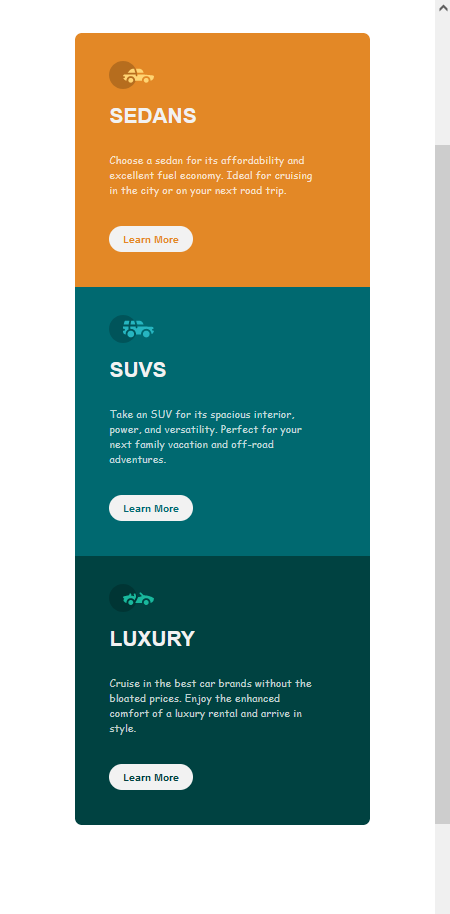

# Frontend Mentor - 3-column preview card component solution

This is a solution to the [3-column preview card component challenge on Frontend Mentor](https://www.frontendmentor.io/challenges/3column-preview-card-component-pH92eAR2-). Frontend Mentor challenges help you improve your coding skills by building realistic projects. 

## Table of contents

- [Overview](#overview)
  - [The challenge](#the-challenge)
  - [Screenshot](#screenshot)
  - [Links](#links)
- [My process](#my-process)
  - [Built with](#built-with)
  - [What I learned](#what-i-learned)
  - [Continued development](#continued-development)
- [Author](#author)

## Overview

### The challenge

Users should be able to:

- View the optimal layout depending on their device's screen size
- See hover states for interactive elements

### Screenshot

### Links

- Solution URL: [Frontendmentor](https://www.frontendmentor.io/challenges/3column-preview-card-component-pH92eAR2-/hub/3-column-responsive-card-page-scss-flexbox-1cxOssMBw)
- Live Site URL: [Netlify](https://festive-brown-ead60e.netlify.app/)

## My process

### Built with

- Semantic HTML5 markup
- SCSS custom properties
- Flexbox
- Mobile-first workflow

### What I learned

Mostly, I learned how to use flexbox better and how to use variables in SCSS. Also, I'm happy that I already understand the principle of using viewport height/width dimensions. Finally, there are no major display errors. Nevertheless, the code is still probably very bad.

### Continued development

I'd like to expand on using a mobile-first approach. Also, I need to improve the use of flexbox and the position property.

## Author

- Website - In future...
- Frontend Mentor - [@yourusername](https://www.frontendmentor.io/profile/Tomushh97)
- Twitter - [@yourusername](https://twitter.com/g_Tomushh)

